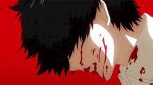
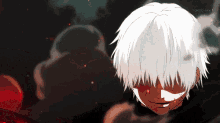

<div align="center">


</div>



### 🩸 `whoami`

```lua
local Yanderov = {
    age    = 14,
    role   = "Luau / Roblox scripter",
    focus  = { "game hacking", "exploit scripting", "reverse engineering" },
    editor = "VS Code",
    anime  = { "Tokyo Ghoul", "romance" },
    status = "always debugging something",
}

return Yanderov
```

### 🛠 Stack


<br clear="right" />

### 🎮 Games


### 📺 Anime


---

<div align="center">



> *"It's not the world that's messed up; it's those of us in it."*
> — Ken Kaneki

<br>

<a href="https://discord.com/users/1480885322731618381"></a>

<br><br>

<a href="https://discord.com/users/1480885322731618381"></a>


</div>
